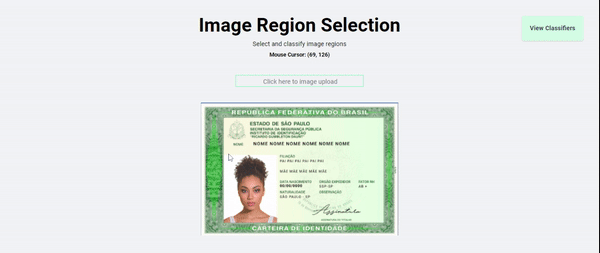

## Purpose
This repository was made with the intention of learning how to use canvas and proof a concept about region selection on images.

## Refs

* https://yushulx.medium.com/a-simple-web-canvas-region-selection-tool-for-barcode-region-detection-69cb3b9e6348
* https://developer.mozilla.org/en-US/docs/Web/API/Canvas_API/Tutorial/Hit_regions_and_accessibility
* https://developer.mozilla.org/pt-BR/docs/Web/API/Canvas_API/Tutorial/Optimizing_canvas
* https://www.w3schools.com/tags/canvas_clip.asp

## Demo
